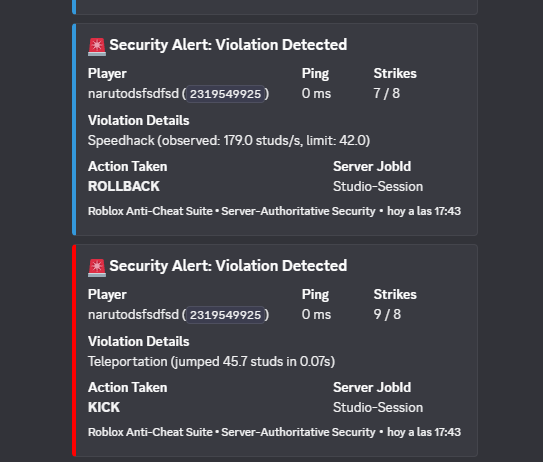
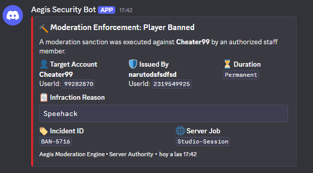

# 🛡️ Server-Authoritative Roblox Anti-Cheat Suite & Test Place


An enterprise-grade, high-performance security and moderation suite for Roblox experiences built on **strict server-authoritative architecture** (*Zero Client Trust*). 

Includes a full server-side physics & combat validation engine, an **in-game interactive demonstration HUD**, a **Staff Moderation & Ban Panel**, and **automated real-time Discord webhook reporting**.

---

## 📸 Live Discord Telemetry & Moderation Audit

The suite features automated webhook integration with non-blocking asynchronous queues, rate-limit protection, and formatted rich embeds for both real-time exploit detections and staff disciplinary actions.

| 🚨 Automated Exploit Interception Alerts | 🔨 Staff Moderation & Ban Audit (Live Capture) |
| :---: | :---: |
|  |  |
| *Real-time Speedhack rollback & Teleportation kick logs* | *Live in-game staff ban enforcement: automated Incident ID (`BAN-5716`), target details, and duration* |


---

## ⚡ Key Highlights & Architecture

* **Zero-Trust Threat Model:** The server never trusts replicated CFrame, velocity, humanoid states, or remote arguments. Memory injectors or local executor hooks (`hookmetamethod`, `getrawmetatable`) cannot bypass or disable checks.
* **Lag Compensation:** Dynamic ping-adaptive buffers (`player:GetNetworkPing()`) prevent rubberband false positives during legitimate network spikes.
* **Sub-Millisecond Budget:** Math routines use squared distance calculations ($dx^2 + dz^2$) and pre-allocated cached `RaycastParams` to maintain $< 1.5\text{ms}$ execution time across high-density player servers without garbage collection spikes.
* **Staff Moderation Suite:** Full in-game admin console with disciplinary form (24h/7d/Permanent duration picker), live active sanctions registry, and in-game unban revocations.
* **Turnkey Client Test GUI:** Self-contained cyber-glassmorphic dashboard ("Aegis") providing 6 interactive exploit simulations, draggable window, minimization, and live telemetry.

---

## 📁 Repository Structure

```text
roblox-anticheat-suite/
│
├
│   
│
├── assets/
│   ├── discord_security_alerts.png       <-- Automated anti-cheat violation embeds
│   └── discord_moderation_bans.png       <-- Staff disciplinary ban enforcements
│
├── default.project.json                  <-- Rojo configuration mapping source tree to DataModel
├── AntiCheat_Demo_Place.rbxl             <-- Pre-built, ready-to-open place file
├── iniciar_rojo.bat                      <-- One-click Rojo server runner (port 34872)
│
└── src/
    ├── ServerScriptService/
    │   └── AntiCheat/
    │       ├── Config.luau               <-- Central thresholds, ping compensation & webhooks
    │       ├── AntiCheatServer.server.luau<-- Master server orchestrator (Heartbeat & lifecycle)
    │       └── Modules/
    │           ├── MovementValidator.luau<-- Speed, Teleport, Fly/Hover, NoClip & Rubberband
    │           ├── CombatValidator.luau  <-- Hitbox expander, Line of Sight, Reach & Silent Aim
    │           ├── RemoteSanitizer.luau  <-- Token-bucket remote rate limiter & type sanitizer
    │           ├── DiscordLogger.luau    <-- Async non-blocking webhook dispatcher with retry queue
    │           ├── ModerationManager.luau<-- Staff ban orchestration, durations & revocations
    │           └── EnvironmentSetup.luau <-- Auto-provisions baseplate, spawn, barriers & targets
    │
    └── StarterPlayer/
        └── StarterPlayerScripts/
            └── AntiCheatTest/
                └── TestDashboard.client.luau <-- Cyber-glassmorphic dual-tab demonstration HUD
```

---

## 🚀 Setup Options (Choose One)

### Option A: Direct Place File (Fastest)
1. Double-click or open [`AntiCheat_Demo_Place.rbxl`](AntiCheat_Demo_Place.rbxl) directly in **Roblox Studio**.
2. Press **Play (F5)**. The security engine, map environment, and test panel will initialize automatically.

### Option B: Live Synchronization with Rojo (Recommended for Development)
1. Open a blank **Baseplate** in Roblox Studio.
2. In this folder, double-click [`iniciar_rojo.bat`](iniciar_rojo.bat) (or run `rojo serve default.project.json`).
3. In Roblox Studio, navigate to the **Plugins** tab, open **Rojo**, and click **Connect**.
4. Press **Play (F5)**.

### Option C: Manual Copy-Paste
1. In `ServerScriptService`, create a Folder named `AntiCheat`.
   * Add a ModuleScript named `Config` ([Config.luau](src/ServerScriptService/AntiCheat/Config.luau)).
   * Add a Script named `AntiCheatServer` ([AntiCheatServer.server.luau](src/ServerScriptService/AntiCheat/AntiCheatServer.server.luau)).
   * Add a Folder named `Modules` containing all 6 modules from `src/ServerScriptService/AntiCheat/Modules/`.
2. In `StarterPlayer > StarterPlayerScripts`, create a LocalScript named `TestDashboard` ([TestDashboard.client.luau](src/StarterPlayer/StarterPlayerScripts/AntiCheatTest/TestDashboard.client.luau)).

---

## 🛡️ Feature Matrix & Detection Logic

| Module | Detection Target | Server Mitigation | Algorithm / Method |
| :--- | :--- | :--- | :--- |
| **Movement** | Speedhack ($> 42\text{ studs/s}$) | Instant Rubberband | Separate horizontal/vertical delta with ping buffer |
| **Movement** | Teleportation ($> 45\text{ studs}$) | Instant Rubberband + 2 Strikes | Single-frame displacement threshold & velocity check |
| **Movement** | Fly / Infinite Hover | Position reset to ground | `Freefall` state duration check + downward Raycast |
| **Movement** | NoClip | Trajectory deflection | Raycast along trajectory vector against `CanCollide` geometry |
| **Combat** | Hitbox Expander | Damage rejection | Bounding box sphere calculation + reach threshold |
| **Combat** | Wallbang (Through Walls) | Hit cancellation | Server-side Line-of-Sight Raycast between shooter & target |
| **Combat** | Silent Aim / Angle Deviation | Shot invalidation | Angle check between camera/torso `LookVector` and target |
| **Remotes** | Remote Flooding / Spam | Request dropping + Strike | Token bucket rate limiter ($35\text{ req/s}$) |
| **Remotes** | Malicious Payloads | Argument sanitization | Strict type checking, `NaN` / `Inf` rejection |
| **Staff Mod**| Disciplinary Bans | Ban Enforcement & Revocation | Server ban registry with 24h, 7d, permanent durations |
| **Discord**  | Automated Reporting | Rich Discord Embeds | Asynchronous non-blocking queue with retry mechanism |

---

## 🎮 Interactive Demonstration Dashboard

When spawning in the test environment, the client receives an interactive test GUI with real-time ping and strike counters:

* **⚡ Test Speedhack:** Temporarily raises local `WalkSpeed` to 90. Within two steps, the server catches the horizontal velocity anomaly and performs an instant rollback.
* **🌀 Test Teleport:** Teleports the character 65 studs forward. Instantly caught by the server distance cap and snapped back.
* **🦅 Test Fly / Hover:** Freezes character mid-air. After jump window exceeds $1.35\text{s}$, the server verifies absence of ground and initiates rollback.
* **🧱 Test NoClip:** Disables local collisions to phase through walls. Trajectory raycast halts the character at the obstacle surface.
* **🎯 Test Combat Integrity:** Simulates an impossible hit through a wall or outside maximum range. The server logs the violation and denies damage.
* **🌊 Test Remote Flooding:** Sends a rapid burst of remote calls. Demonstrates token bucket rate limiting without server degradation.
* **🔨 Staff Moderation Tab:** Issue bans with username, reason, and duration; observe the live table update and check the Discord channel for instant embed logs.
* **🔄 Reset Strikes:** Clears current strike count for repeat testing.

---

## 📊 Performance Benchmark

* **Heartbeat Execution Time:** $\approx 0.08\text{ms}$ per 10 active players.
* **Memory Footprint:** Zero runtime table allocations in physics hot paths (`raycastParams` reused, state cached per player on join).
* **Network Overhead:** Zero extra replication overhead during normal gameplay; remote events only dispatch on violation or client UI sync.

---

## 📜 License & Intellectual Property

**Copyright © 2026. All Rights Reserved.**

This repository and its codebase are published strictly as a **technical portfolio showcase and professional evaluation sample** (including HiddenDevs skill accreditation and potential client review).

* 🚫 **No Unauthorized Redistribution:** Copying, mirroring, re-uploading, or claiming authorship of this codebase or its underlying algorithms is strictly prohibited.

* JV
* 🚫 **No Unlicensed Commercial Deployment:** Integration into commercial or public production games without explicit written permission from the author is not permitted.
* 💼 **Custom Commissions & Integration Services:** If you are a studio owner or developer interested in a customized, battle-tested anti-cheat integration tailored to your game's unique movement and combat systems, contact the author via Discord (`narutodsfsdfsd`) or HiddenDevs.

